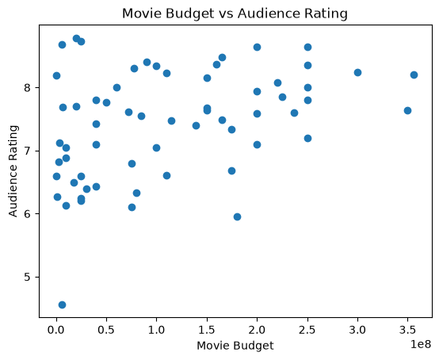
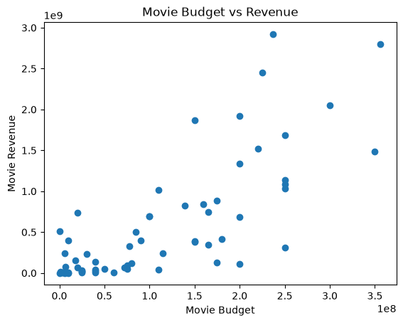

# Projects
This section documents my data science projects, research questions, and data stories I create throughout the semesters.
---
## Project 1

### Research Question

Do movies with higher budgets tend to receive higher audience ratings and earn more revenue?

### Dataset Source

The data for this project will come from The Movie Database (TMDB) API. The dataset will include movie information such as budget, revenue, audience rating, genre, and release date.

That covers the source part of the rubric, but later we’ll still need to add the dataset’s unit of analysis,

### Unit of Analysis

Each row in the dataset represents one movie.

### Features and Variables

The dataset will include the following variables:

- Movie Title
- Budget
- Revenue
- Audience Rating
- Genre
- Release Year

### Variable Descriptions

- **Budget:** The amount of money spent to produce the movie.
- **Revenue:** The amount of money the movie earned.
- **Audience Rating:** The average rating given by viewers.
- **Genre:** The category or type of movie.
- **Release Year:** The year the movie was released.

### Dataset Size
The dataset will include a collection of movies from The Movie Database (TMDB) API. The exact number of movies will be recorded after the data is collected.

### Missing Values
Missing values will be checked after the data is collected from the TMDB API. Movies with missing budget, revenue, or rating information may need to be removed or handled during data cleaning.

### Data Cleaning
The data will be cleaned using pandas. I will check for missing values, remove movies with unusable budget or revenue data, and make sure the variables are in the correct format for analysis.

### Visualizations
 
 
 
 
#### Budget vs Audience Rating

The first visualization compares movie budget and audience rating. The graph shows that higher-budget movies do not always receive much higher ratings.

#### Budget vs Revenue

The second visualization compares movie budget and revenue. The graph shows a clearer positive relationship, where higher-budget movies tend to earn more revenue.

### Results

The correlation between movie budget and audience rating was about 0.38, which shows a weak-to-moderate positive relationship. This means that higher-budget movies sometimes receive higher ratings, but the relationship is not very strong.

The correlation between movie budget and revenue was about 0.76, which shows a strong positive relationship. This suggests that movies with higher budgets tend to earn more revenue.

### Limitations
This dataset may have missing or incomplete information for some movies, especially budget and revenue values. Audience ratings may also be affected by the number and type of users who rated each movie. The dataset may not represent every movie equally, so the results should be interpreted with caution.

### Code
YOUR_CODE_LINK_HERE

### References
At least three peer-reviewed sources related to movie budgets, audience ratings, revenue, or film performance will be included here in APA format.

### AI Usage
AI tools were used to help organize the project, explain concepts, and improve the clarity of the written sections. The data analysis, code, and final interpretations were reviewed and completed by me.
