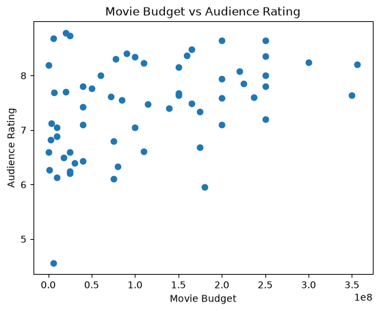
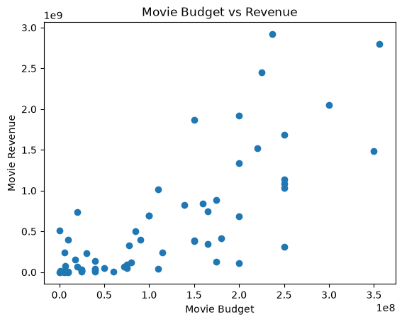
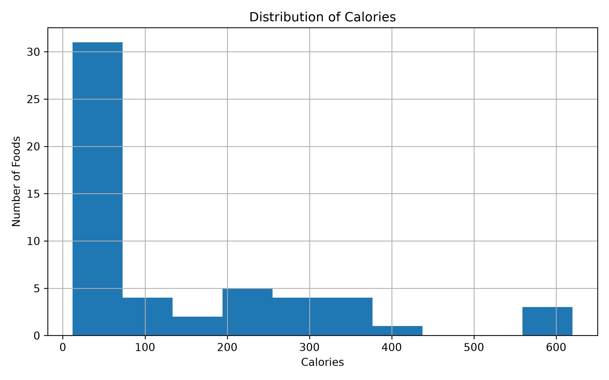
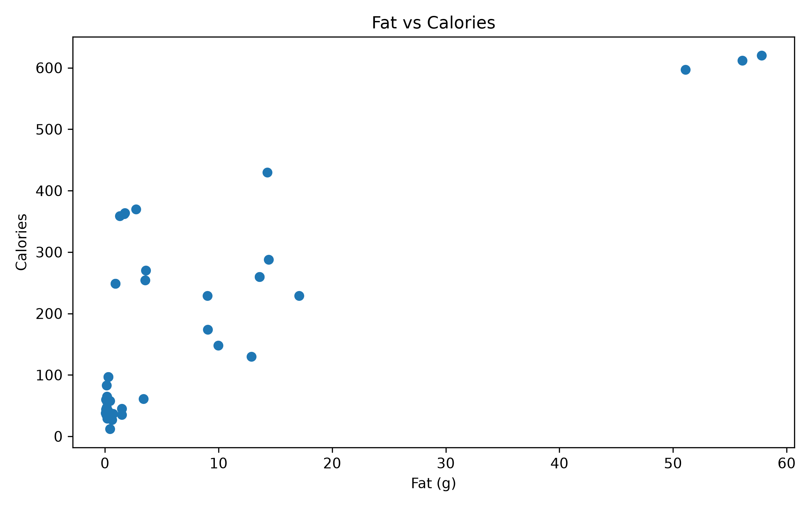
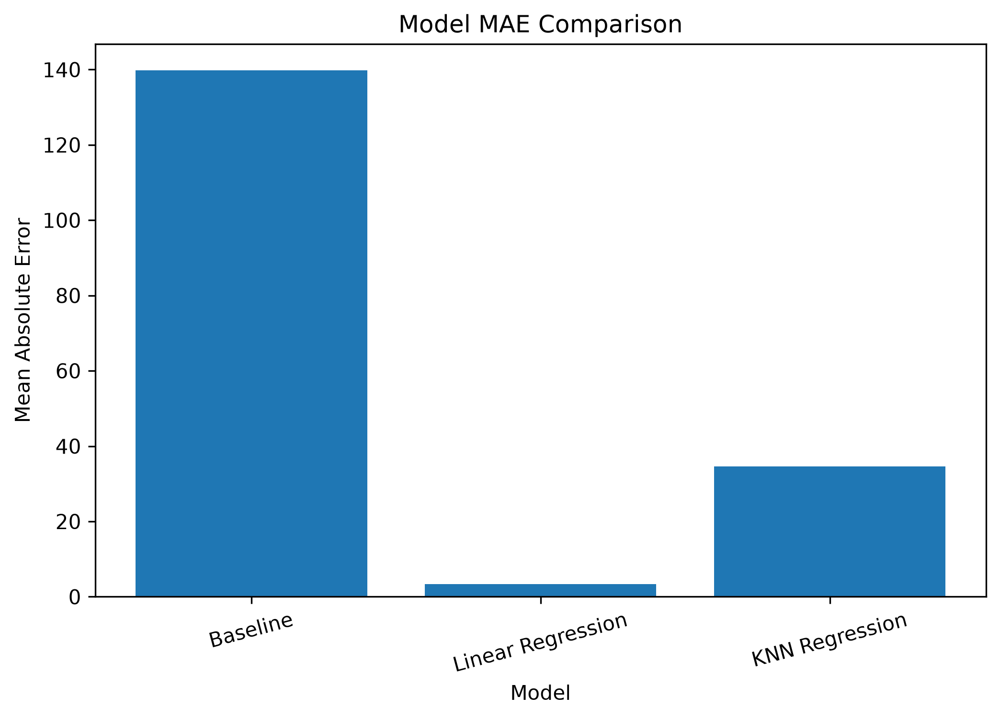

# Projects
This section documents my data science projects, research questions, and data stories I create throughout the semesters.
---
## Project 1

### Research Question

Do movies with higher budgets tend to receive higher audience ratings and earn more revenue?

### Background

Movie studios spend very different amounts of money producing films. Larger budgets can allow studios to hire well-known actors, use more advanced special effects, increase marketing, and expand distribution.

I chose this topic because I wanted to see whether spending more money on a movie is actually connected to better outcomes. A larger budget may help a movie earn more money, but it does not necessarily mean audiences will enjoy the movie more.

This question could be useful for movie studios, producers, and even movie fans because it helps show whether production spending is more strongly connected to financial success or audience reception.

This project compares movie budget with both audience ratings and revenue to see which relationship is stronger.

### Dataset Source

The data for this project comes from The Movie Database (TMDB) API.

I chose TMDB because it provides movie information including budget, revenue, audience ratings, genre, and release date in one source, which makes it useful for comparing financial information with audience reactions.

The dataset originally included 100 movies.

### Unit of Analysis

Each row in the dataset represents one movie.

### Features and Variables

The dataset includes the following variables:

- **Movie Title:** Identifies each movie.
- **Budget:** The amount of money spent to produce the movie.
- **Revenue:** The amount of money the movie earned.
- **Audience Rating:** The average TMDB user rating for the movie.
- **Release Date:** The date the movie was released.

### Dataset Size
The original dataset contained 100 movies. After removing movies with missing or unusable budget and revenue values, 62 movies remained for analysis.

### Missing Values
Some movies had a budget or revenue value of 0, which was treated as missing or unusable data. These movies were removed because they could not be used to analyze the relationship between budget, revenue, and audience rating.

### Data Cleaning
The data was cleaned using pandas. Movies with a budget of 0 or revenue of 0 were treated as having missing or unusable financial data and were removed.

The original dataset had 100 movies, and 62 movies remained after cleaning.

### Visualizations
 
 
 
 
#### Budget vs Audience Rating

The first visualization compares movie budget with audience rating.

There is a slight upward trend, but the points are widely spread out. This suggests that spending more money on a movie does not guarantee that audiences will rate it much higher.

This is interesting because it shows that factors other than budget, such as story, acting, genre, or audience expectations, may play an important role in how viewers rate a movie.

#### Budget vs Revenue

The second visualization compares movie budget with revenue.

This graph shows a much clearer positive relationship. Movies with larger budgets generally tended to earn more revenue.

Compared with the audience-rating graph, the pattern is much stronger. This suggests that production spending may have a stronger relationship with financial performance than with audience satisfaction.

### Results

The results showed two very different relationships.

The correlation between movie budget and audience rating was about **0.38**, which represents a weak-to-moderate positive relationship. Higher-budget movies sometimes received higher audience ratings, but the relationship was not very strong.

The correlation between movie budget and revenue was about **0.76**, which represents a strong positive relationship. Movies with larger production budgets generally tended to earn more revenue.

The most interesting result was the difference between these two correlations. Budget was much more strongly related to revenue than it was to audience rating.

This suggests that spending more money may help a movie achieve greater financial success through factors such as production scale, marketing, or distribution, but spending more money does not necessarily make audiences enjoy the movie more.

Overall, the results suggest that budget appears to be more useful for explaining financial performance than audience satisfaction.

### Interesting Findings

One of the most interesting findings was that the two outcomes behaved differently even though they were compared with the same variable.

Budget had only a moderate relationship with audience ratings but had a strong relationship with revenue.

This shows why it is important to examine more than one measure of movie success. A movie can be financially successful without receiving especially high audience ratings, while a highly rated movie does not necessarily need one of the largest production budgets.

The visualizations also show that not every movie follows the overall trend. Some movies appear farther away from the main pattern, showing that budget alone cannot explain every movie's performance.

### Limitations

This analysis has several limitations.

The original dataset contained 100 movies, but movies with a budget or revenue value of 0 were removed because those values could not be used reliably. This reduced the final dataset to 62 movies.

Removing these movies may have affected the results because films with missing financial information may differ from the movies that remained in the dataset.

The dataset also contains a sample of popular movies from TMDB, so it may not represent all movies equally. Smaller independent films, older movies, or less popular movies may be underrepresented.

Audience ratings also have limitations because they depend on who chooses to rate a movie and how many users submit ratings.

Finally, correlation does not prove causation. The results show that budget and revenue are strongly related in this sample, but they do not prove that increasing a movie's budget will automatically increase its revenue. Other factors such as marketing, franchise popularity, release timing, genre, and star power could influence the results.

### Conclusion

This project asked whether movies with higher budgets tend to receive higher audience ratings and earn more revenue.

The results suggest that the answer depends on how movie success is measured.

Higher budgets had only a weak-to-moderate relationship with audience ratings, while they had a much stronger relationship with revenue.

This means that a larger production budget may be associated with greater financial success, but it does not guarantee that audiences will rate a movie more highly.

The project helped show that financial success and audience satisfaction are different outcomes and that looking at both provides a more complete picture of movie performance.

### Code
[View Project Notebook](https://github.com/isivaraj/data-science-portfolio/blob/main/movie_project.ipynb)

### References

Simonton, D. K. (2005). Cinematic creativity and production budgets: Does money make the movie? *The Journal of Creative Behavior, 39*(1), 1–15. https://doi.org/10.1002/j.2162-6057.2005.tb01246.x

Ravid, S. A. (1999). Information, blockbusters, and stars: A study of the film industry. *The Journal of Business, 72*(4), 463–492. https://doi.org/10.1086/209624

Moon, S., Bergey, P. K., & Iacobucci, D. (2010). Dynamic effects among movie ratings, movie revenues, and viewer satisfaction. *Journal of Marketing, 74*(1), 108–121. https://doi.org/10.1509/jmkg.74.1.108

### AI Usage
AI tools were used to help organize the project, explain concepts, and improve the clarity of the written sections. The data analysis, code, and final interpretations were reviewed and completed by me.

---

## Project 2: Predicting Calories from Nutritional Information

### Research Question

Can the nutritional characteristics of a food be used to predict its calorie content?

### Background

I chose this topic because nutrition information is something people interact with every day when comparing foods, reading labels, or making dietary decisions.

Calories represent the amount of energy provided by food. Nutrients such as carbohydrates, protein, and fat contribute to the energy content of food, which suggests that these variables may be useful predictors of calories.

This makes the problem meaningful because predicting calorie content from nutritional information could help show which nutrients are most strongly connected to energy content.

This project uses USDA FoodData Central because it provides standardized nutritional information for many foods and includes variables that can be used for machine-learning analysis.

The goal is not to replace official nutrition labels, but to investigate whether nutritional features can be used to estimate calorie content with reasonable accuracy. 

### Dataset Source

The data comes from the USDA FoodData Central Foundation Foods dataset.

I chose this dataset because it contains standardized food-level nutritional information, including calories, protein, carbohydrates, fat, fiber, and sodium.

These variables make the dataset useful for a regression problem because they provide measurable nutritional characteristics that may help explain differences in calorie content.

### Unit of Analysis

Each row in the final dataset represents one food.

### Target Variable

The target variable is:

- Calories

This is a regression problem because calories are numerical values.

### Features and Variables

The predictor variables used in the model are:

- Protein
- Carbohydrates
- Fat
- Fiber
- Sodium

### Dataset Size

Before removing missing values, the merged Foundation Foods dataset contained 448 foods.

After removing rows with missing values, 54 foods remained for modeling.

### Missing Values

Some foods were missing one or more of the nutritional variables needed for modeling.

Rows with missing values were removed so that every observation contained complete information for the selected features and target.

### Data Cleaning

The food and nutrient datasets were combined using each food's USDA FoodData Central ID.

Only Foundation Foods were included in the analysis.

The nutrient data was reorganized so that each food had one row containing values for calories, protein, carbohydrates, fat, fiber, and sodium.

Rows containing missing values in the selected variables were removed so that every observation used for modeling had complete information.

After cleaning, 54 foods remained.

This decision reduced the size of the dataset, but it prevented the models from being trained on incomplete observations.

### Visualizations

#### Distribution of Calories

The calorie distribution shows that most foods in the dataset are concentrated at lower calorie values, while a smaller number of foods have much higher calorie values.

This uneven distribution suggests that some foods may act as outliers.

These extreme values are important because they can increase prediction error and may affect model performance, especially in a relatively small dataset.

This exploration showed that the model would need to handle both typical foods and foods with unusually high calorie values.

#### Fat vs Calories

The relationship between fat and calories shows a clear upward pattern.

Foods with more fat generally tend to have higher calorie values.

This makes fat a useful predictor because fat contributes substantially to the energy content of food.

The pattern supported including fat as one of the features in the model, along with protein, carbohydrates, fiber, and sodium.

### Feature Selection

The final predictor variables were:

- Protein
- Carbohydrates
- Fat
- Fiber
- Sodium

These variables were selected because they describe major nutritional characteristics of food and may help explain differences in calorie content.

Fat, carbohydrates, and protein are directly connected to food energy, while fiber and sodium provide additional information about food composition.

Food name was not used as a predictor because it is an identifier rather than a numerical nutritional feature.

Calories were used as the target variable. 

### Train/Test Split

The cleaned dataset was divided into:

- 80% training data
- 20% testing data

A fixed `random_state=42` was used so the split could be reproduced.

The models were trained only on the training data and evaluated using the testing data.

This helps prevent data leakage because the model does not learn from the observations that are later used to evaluate its performance.

The same training and testing split was used for both models so the comparison would be fair.

### Baseline Model

Before training the machine-learning models, I created a baseline model.

The baseline predicted the average calorie value from the training data for every food in the testing set.

This represents a simple prediction strategy that does not use any nutritional features.

The purpose of the baseline is to provide a benchmark. A useful machine-learning model should perform better than simply predicting the average calorie value for every food.

### Machine Learning Models

Two regression models were trained and compared.

#### Linear Regression

Linear Regression was selected because the target variable, calories, is numerical and several nutritional variables have approximately linear relationships with calorie content.

This model also makes it easier to interpret how each predictor contributes to the final prediction.

#### K-Nearest Neighbors Regression

K-Nearest Neighbors Regression was selected as a second model because it predicts calories based on foods with similar nutritional characteristics.

Before fitting KNN, the numerical features were standardized.

Scaling was important because KNN relies on distance calculations. Variables such as sodium have much larger numerical values than variables such as protein or fat, so scaling prevents larger-scale variables from dominating the distance calculation.

Both models were trained and tested using the same data split so their performance could be compared fairly.

### Results

The models were evaluated using Mean Absolute Error (MAE).

MAE measures the average absolute difference between the model's predicted calorie values and the actual calorie values.

A lower MAE represents better predictive performance because it means the predictions are closer to the true values.

| Model | MAE |
|---|---:|
| Baseline | ADD BASELINE MAE |
| Linear Regression | ADD LINEAR MAE |
| KNN Regression | ADD KNN MAE |

The best-performing model was **ADD FINAL MODEL HERE**.

This model was selected because it had the lowest MAE and therefore produced the most accurate calorie predictions on the testing data.

The comparison with the baseline is especially important because it shows whether the machine-learning models actually learned useful patterns from the nutritional features.

### Interesting Findings and Prediction Errors

One important finding was that the nutritional features were useful for predicting calorie content, but the model did not perform equally well for every food.

Foods with typical nutritional values were generally easier to predict, while foods with unusual nutrient combinations or very high calorie values could produce larger prediction errors.

This is especially important because the dataset is small. A few unusual foods can have a noticeable effect on the overall error metric.

Looking at individual prediction errors helps show that a model can have a good overall score while still performing poorly on certain observations.

### Model Interpretation

The model results suggest that nutritional characteristics contain useful information for predicting calorie content.

Fat, carbohydrates, and protein are especially important because they contribute directly to the energy content of food.

If Linear Regression performs best, this suggests that much of the relationship between nutrients and calories can be represented using relatively simple linear relationships.

The model should not be interpreted as proving that every feature directly causes changes in calories. Instead, it identifies relationships present in this dataset.

The model is also more reliable for foods that are similar to the foods in the training data and may be less reliable for foods with unusual nutritional profiles.

### Limitations and Ethics

This project has several limitations.

Only 54 foods remained after removing rows with missing values, so the final dataset is relatively small.

The dataset may not represent every food category equally. Certain types of foods may be overrepresented or underrepresented.

Removing observations with missing data may also introduce bias because the foods with complete information may differ from foods that were removed.

Prediction errors could also have real consequences if the model were used for nutrition or health decisions. An incorrect calorie estimate could mislead someone who is trying to manage their diet or health.

For this reason, the model should not replace official nutrition labels, USDA data, medical advice, or professional dietary guidance.

The model is best viewed as an educational machine-learning analysis rather than a real-world decision-making tool.

### Future Improvements

There are several ways this project could be improved.

A larger and more diverse food dataset would likely make the results more reliable.

Additional nutritional features could also be included, such as sugar content, saturated fat, cholesterol, or food category.

Future versions of the project could also test additional regression models, use cross-validation, and perform hyperparameter tuning.

Another useful extension would be to examine prediction errors in more detail and identify which types of foods are hardest for the model to predict.

### Conclusion

This project asked whether nutritional characteristics can be used to predict the calorie content of foods.

The results suggest that nutritional features do contain useful predictive information.

By comparing a baseline model with Linear Regression and K-Nearest Neighbors Regression, I was able to evaluate whether machine-learning models performed better than simply predicting the average calorie value.

The best-performing model was **ADD FINAL MODEL HERE**, which produced the lowest prediction error.

Overall, the project shows that features such as fat, carbohydrates, protein, fiber, and sodium can be used to estimate calorie content, although the small dataset and unusual observations limit how broadly the results can be applied.

### Code

[View Project Notebook](nutrition_project.ipynb)

[View Cleaned Dataset](food_nutrition_clean.csv)

### References

National Academies of Sciences, Engineering, and Medicine. (2023). *Dietary reference intakes for energy*. National Academies Press.

National Institute of Environmental Health Sciences. (n.d.). *Nutrition, health, and your environment*. National Institutes of Health.

U.S. Department of Agriculture. (n.d.). *FoodData Central*. U.S. Department of Agriculture.

U.S. Department of Agriculture & U.S. Department of Health and Human Services. (2020). *Dietary Guidelines for Americans, 2020–2025* (9th ed.).

### AI Usage

I used OpenAI ChatGPT, GPT-5.6, as a support tool during this project.

I completed the data analysis, coding, model development, interpretation, and final decisions myself. ChatGPT was mainly used to help clarify machine-learning concepts, troubleshoot specific coding errors, improve the organization of my write-up, and review whether my project addressed the assignment requirements.

All code was run and checked by me, and I reviewed and edited the final explanations and conclusions before publishing the project.
